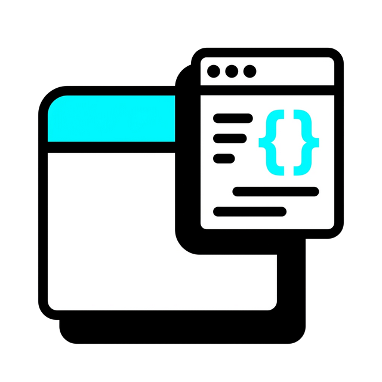
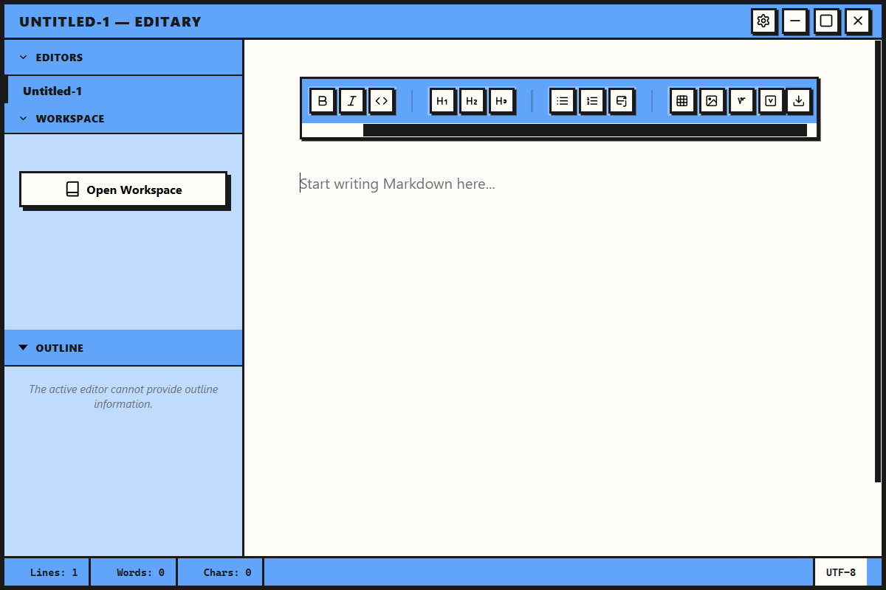

#  editary

[日本語版 (README.ja.md)](README.ja.md)

**editary** is a Typora-inspired Markdown editor with a bold **Neo-brutalism** aesthetic. Built on the cutting-edge **Electrobun** (Bun-based desktop framework), it delivers a high-performance typing experience and a modern UI.



## ✨ Features

- **Typora-like Writing Experience**: Seamlessly edit Markdown with a real-time preview powered by Tiptap.
- **Neo-brutalism UI**: A bold, high-contrast design with thick borders and vibrant colors.
  - **App Window Frame**: High-impact black borders around the entire application.
  - **Refined Settings**: Optimized vertical layouts for better usability.
  - **Customizable Themes**: Switch between light and dark modes with unique neo-brutalist palettes.
  - **Sidebar Navigation**: Intuitive file management with a clean, border-heavy aesthetic.
- **Advanced Markdown Support**:
  - 📊 **Mermaid**: Create diagrams and charts directly in your notes.
  - 🧪 **KaTeX**: High-quality math typesetting for formulas.
  - 📝 **Task Lists**: Manage your TODOs with interactive checkboxes.
  - 🧮 **Tables**: Rich table editing with a simple interface.
- **Modern Tech Stack**: Leveraging the speed of **Bun** and the flexibility of **Electrobun**.
- **Search & Replace**: Efficiently find and modify content within your documents.

## 🛠 Tech Stack

- **Framework**: [Electrobun](https://electrobun.dev/) (Native WebView + Bun Runtime)
- **Runtime**: [Bun](https://bun.sh/)
- **Editor**: [Tiptap](https://tiptap.dev/)
- **Visuals**: [Mermaid](https://mermaid.js.org/), [KaTeX](https://katex.org/)
- **Build**: [electrobun-builder](https://github.com/Catharacta/electrobun-builder) (NSIS/WiX installers)

## 🚀 Getting Started

### Prerequisites

- [Bun](https://bun.sh/) installed on your system.

### Build and Run

1. Clone the repository:
   ```bash
   git clone https://github.com/Catharacta/editary.git
   cd editary
   ```

2. Install dependencies:
   ```bash
   bun install
   ```

3. Run in development mode:
   ```bash
   bun start
   ```

4. Build the installer (Windows):
   ```bash
   bun run build:installer
   ```

## 📦 Downloads

Check out the [Releases](https://github.com/Catharacta/editary/releases) page for the latest Windows installers (`.exe` and `.msi`).

## 📄 License

This project is licensed under the [MIT License](LICENSE).
